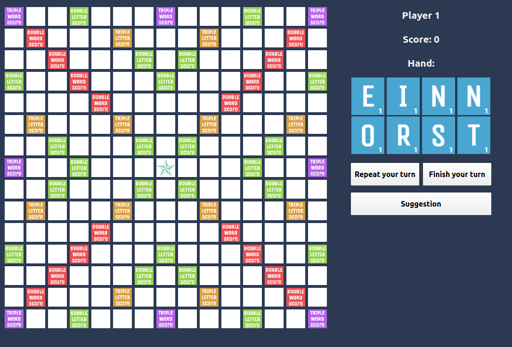

## Igra Scrabble

# Kratak opis igre
Scrabble je drustvena igra recima, koju igraju od dva do cetiri igraca. Cilj je osvojiti poene postavljanjem plocica koja oznacavaju slova na kvadratnu tablu(dimenzije variraju); plocice moraju formirati reci iz nekog unapred prihvacenog recnika(takodje, u nekim verzijama  postoji dzoker plocica, koja se moze pretvoriti u bilo koje slovo alfabeta). Igra se po zvanicnim pravilima zavrsava za neki od sledecih scenarija: 
- jedan igrac je odigrao sva slova iz svoje ruke i niti jedno nije ostalo u njegovoj "vreci", nezavisno od drugog igraca
- najmanje sest poteza bez promene rezultata i neki od igraca odluci da se igra zavrsi
- neki od igraca premasi ograniceno vreme za potez

Na kraju, od rezultata se oduzima suma vrednosti neiskoriscenih slova igraca. Naravno, sva ova pravila su podlozna promenama, cemu svedoce mnogobrojne varijante ove drustvene igre.

# 
 
# Projekat Igra Scrabble
Popularna drustvena igra za 2 do 4 igraca, ciji je cilj da se pozicioniranjem slova na tabli ostvari pobeda najvecim rezultatom,    u unapred propisanim okvirima.

### :wrench: Kako pokrenuti igru:

- <b> Pokretanje iz izvornog koda:</b> 

Prvi korak je preuzimanje [Qt](https://www.qt.io/) framework-a, kao i alata Qt Creator.  
Nakon kloniranja repozitorijuma, pozicionirajte se unutar foldera 10-igra-scrabble.  
Unutar foldera se nalazi Igra_Scrabble.pro datoteka. Otvorite je pomocu QT Creator alata.  
Kliknite na zeleno dugme u obliku trougla u donjem levom uglu; time ce se build-ovati i pokrenuti projekat.
  

### :movie_camera: Demo video:
- [Demo video](https://youtu.be/Lp03AsFrZUo) 

# Developeri
<ul>
    <li><a href="https://gitlab.com/tadejgojic99">Tadej Gojić 79/2018</a></li>
    <li><a href="https://gitlab.com/milica_k">Milica Kostadinović 271/2018</a></li>
    <li><a href="https://gitlab.com/nikoladelic99">Nikola Delić 95/2018</a></li>
    <li><a href="https://gitlab.com/tekisooj">Teodora Vasić 1/2018</a></li>
    <li><a href="https://gitlab.com/jelena_zaric">Jelena Zarić 79/2019</a></li>
</ul>
